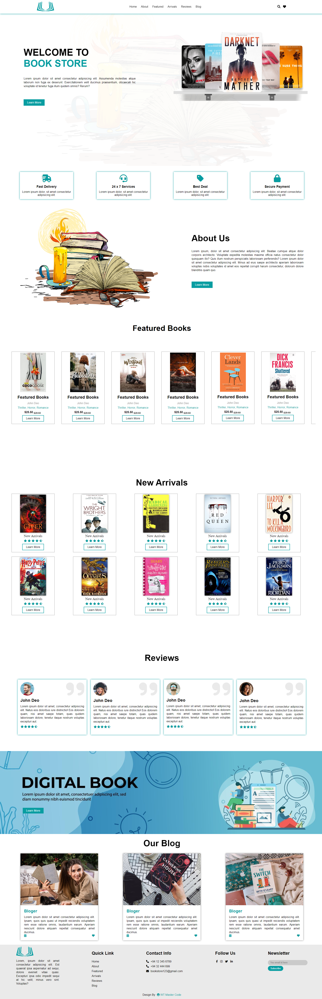

# Responsive Book Store

A responsive online book store website built using **HTML**, **SASS**, and **Media Queries**. This project was developed during my training at **ASAL Technology** and showcases a modern, user-friendly interface for browsing, reviewing, and discovering books.

## 📸 Screenshot

## 🚀 Live Demo

Check out the live version here: [https://jasminqabaha.github.io/Book_Store/](https://jasminqabaha.github.io/Book_Store/)

## 💻 Technologies Used

- HTML
- SASS (SCSS)
- Media Queries (Responsive Design)

## 📬 Contact

Built with ❤️ during training at ASAL Technology.  

